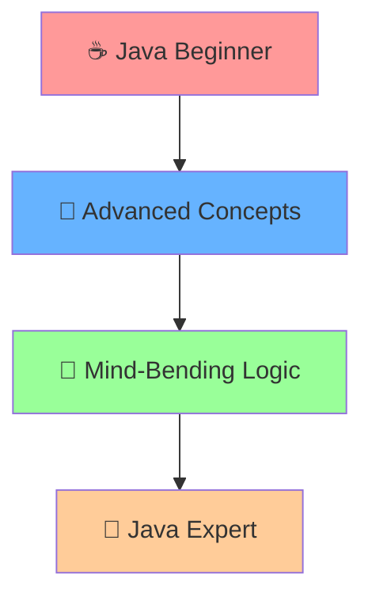
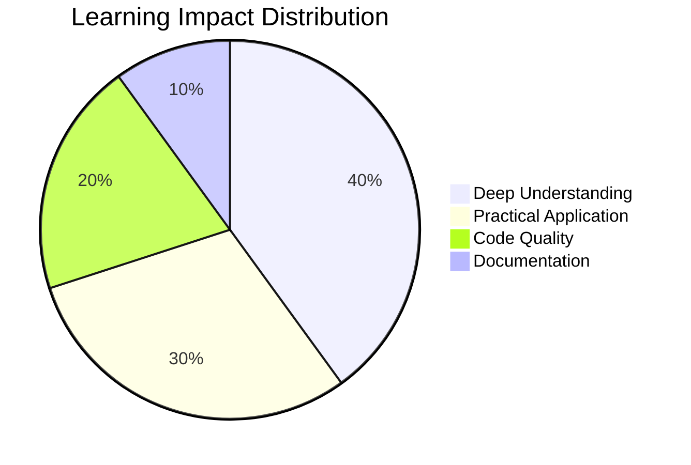
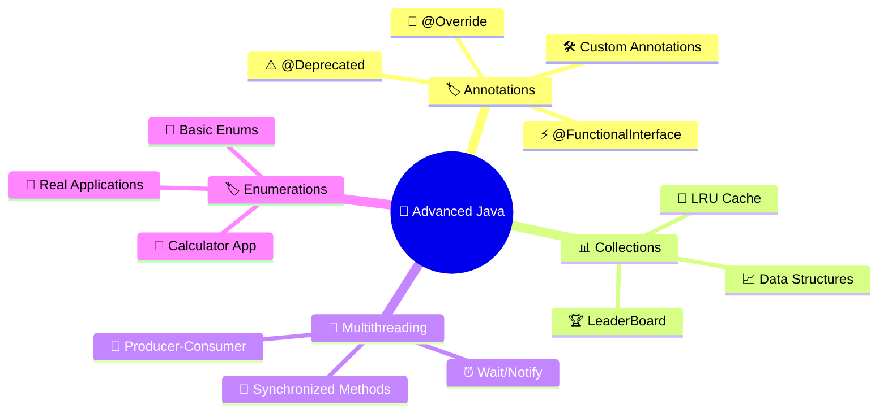
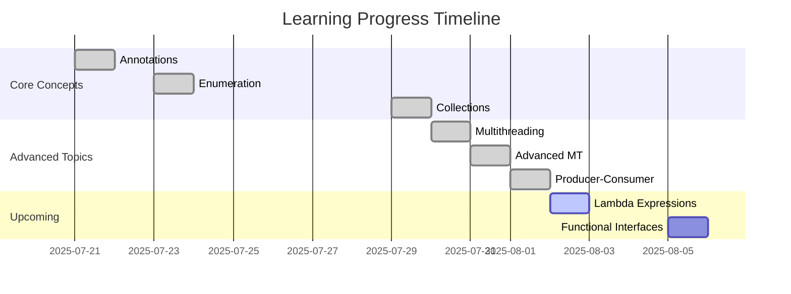
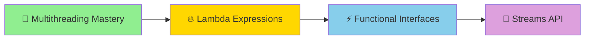
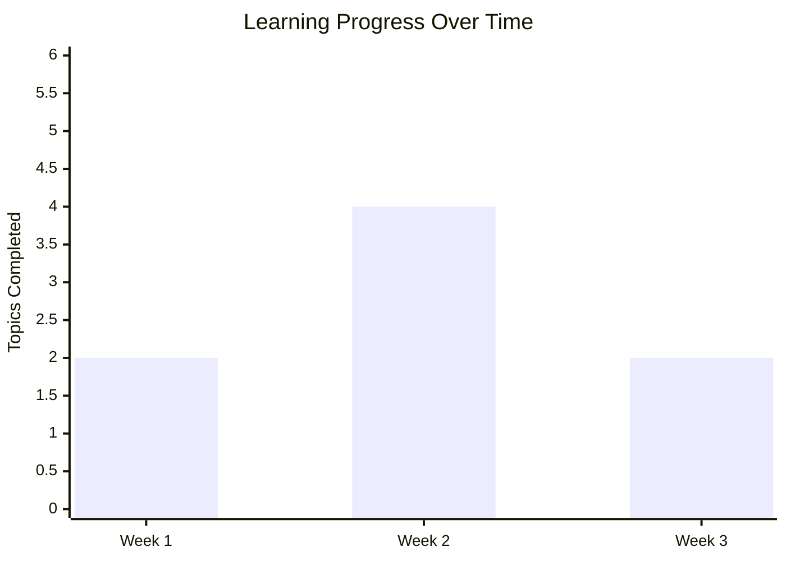

# 🚀 AdvanceJava-Programs

<div align="center">


<br/>


*From zero to hero, one commit at a time* ⚡

<br/>


</div>

> [!NOTE]
> This repository is a **living documentation** of my Advanced Java learning journey. Each day brings new challenges, concepts, and breakthroughs!

---

## 📖 What's This All About?

> [!TIP]
> **Welcome to my Advanced Java mastery journey!** 🎯 

This isn't just another code repository — it's a **living documentation** of my daily grind to conquer the most mind-bending concepts in Java. Every single day, I'm pushing hands-on programs with crystal-clear code that even your grandma could understand (okay, maybe not grandma, but you get the idea! 😄).



Whether you're a fellow Java enthusiast, a beginner trying to level up, or someone who accidentally stumbled here while looking for coffee recipes — **you're welcome to join the ride!** 🎢

---

## ✨ Features That'll Make You Go "Wow!"

> [!IMPORTANT]
> These features make this repository stand out from the crowd!

<div align="center">

| 🎯 Feature | 📝 Description | 🔥 Impact |
|------------|----------------|-----------|
| 📅 **Daily Progress Tracking** | Consistent learning, no excuses! | 🟢 High |
| 🧠 **Concept-Driven Approach** | Deep dive into WHY, not just HOW | 🟢 High |
| 📝 **Clean, Commented Code** | Every line tells a story | 🟡 Medium |
| 🎯 **Beginner-Friendly** | Complex concepts, simple explanations | 🟢 High |
| 🏗️ **Well-Structured Organization** | Find what you need, fast! | 🟡 Medium |
| 💡 **Real-World Examples** | Code that actually makes sense | 🟢 High |
| 🔄 **Progressive Learning** | From basics to brain-melting advanced stuff | 🔴 Critical |

</div>



---

## 🗂️ What's Inside This Treasure Chest?

> [!IMPORTANT]
> **Learning Gold Mine** - Each folder is packed with knowledge and practical examples! 💎



### 📁 Repository Structure Overview

> [!WARNING]
> **Complex Concepts Ahead!** ⚠️  
> Multithreading and advanced Collections may cause temporary confusion followed by enlightenment! 🤯

<div align="center">

| 📁 Topic | 💡 Description | 🌟 Difficulty | 🚀 Impact | 🎯 Priority |
|----------|----------------|---------------|-----------|-------------|
| **🏷️ Annotations** | Meta-programming with `@Override`, `@Deprecated`, Custom Annotations | ⭐⭐ Easy | 🔥🔥🔥 High | 📈 HIGH |
| **📊 Collections** | Advanced data structures, LeaderBoard, LRU Cache implementations | ⭐⭐⭐ Medium | 🔥🔥🔥🔥 Very High | 🚨 CRITICAL |
| **🏷️ Enumerations** | From basic enums to building real calculator applications | ⭐⭐ Easy | 🔥🔥🔥 High | 📈 HIGH |
| **🧵 Multithreading** | Producer-Consumer, Synchronization, Concurrent Programming | ⭐⭐⭐⭐ Hard | 🔥🔥🔥🔥🔥 Extreme | 🚨 CRITICAL |

</div>

---

```
📦 AdvanceJava-Programs/
├── 📁 Annotations/              # Meta-data magic & compiler hints
│   ├── 📄 01Notes.txt          # Core concepts & theory
│   ├── ☕ MyOverride.java      # @Override annotation in action
│   ├── ☕ MyFunctionalInterface.java  # Functional programming vibes
│   ├── ☕ MyDeprecated.java    # Legacy code warnings
│   ├── ☕ MySuppressWarnings.java     # Suppress compiler warnings
│   └── 📁 MyCustomAnnotation/  # Custom annotation deep dive
│       ├── 📄 01Notes.txt      # Custom annotation theory
│       ├── ☕ Info.java        # Custom @Info annotation
│       ├── ☕ MyClass.java     # Annotation usage examples
│       └── ☕ AnnotationReader.java   # Reflection magic
├── 📁 Enumeration/              # Enum constants & advanced usage
│   ├── 📄 01Notes.txt          # Enumeration fundamentals
│   ├── ☕ EnumOne.java         # Basic enum with values
│   ├── ☕ EnumTwo.java         # Enum methods & iteration
│   ├── ☕ EnumThree.java       # Advanced enum features
│   ├── ☕ EnumFour.java        # Enum best practices
│   └── 📁 Calculator/          # Real-world enum applications
│       └── ☕ EnumFive.java    # Calculator using enums
├── 📁 JavaCollectionsFrameWorks/ # Data structures mastery & algorithms
│   ├── ☕ CollectionsDemo.java # HashSet operations & examples
│   ├── ☕ HashMapDemo.java     # HashMap key-value operations
│   ├── ☕ MyPriorityQueue.java # Priority queue implementation
│   ├── ☕ OwnPriorityQueue.java # Custom priority queue logic
│   ├── ☕ LeaderBoardExample.java # Real-world ranking system
│   ├── ☕ LRUCacheExample.java # LRU Cache implementation with LinkedHashMap
│   └── ☕ Practical.java       # Collections utility showcase
├── 📁 Lambda/                   # (Coming Soon) Functional programming revolution
├── 📁 Streams/                  # (Coming Soon) Data processing like a boss
├── 📁 Generics/                 # (Coming Soon) Type-safe collections
├── 📁 Multithreading/           # Thread creation, synchronization & advanced communication
│   ├── ☕ MessageTest.java     # Inter-thread communication examples
│   ├── ☕ SynchronizationExample.java # Advanced synchronization patterns
│   ├── ☕ MyBuffer.java        # Producer-Consumer with wait/notify
│   └── ☕ Bufferrrr.java       # Enhanced Producer-Consumer implementation
└── 📄 README.md                # You are here! 👈
```

---

## 🎯 Learning Roadmap & Progress

> [!SUCCESS]
> **6 Major Topics Completed** in just 12 days! Outstanding pace! 🚀

### 🟢 Completed Topics

<div align="center">

| Day | Topic | Status | Completion Date | Key Learnings | Difficulty |
|-----|-------|:------:|:---------------:|---------------|:----------:|
| **01** | **Annotations** | ✅ | `July 21, 2025` | Meta-data magic, `@Override`, `@Deprecated`, `@FunctionalInterface`, Custom annotations with Reflection | 🟡 Medium |
| **02** | **Enumeration** | ✅ | `July 23, 2025` | Enum constants, methods, values(), advanced patterns, Calculator implementation | 🟢 Easy |
| **03** | **Java Collections Framework** | ✅ | `July 29, 2025` | HashSet, HashMap, PriorityQueue, LeaderBoard systems, LRU Cache, data structure optimization | 🔴 Hard |
| **04** | **Multithreading** | ✅ | `July 30, 2025` | Thread creation, synchronization, locks, concurrent programming, parallel processing | 🔴 Hard |
| **05** | **Advanced Multithreading** | ✅ | `July 31, 2025` | Message passing, synchronization examples, inter-thread communication patterns | 🔴 Hard |
| **06** | **Producer-Consumer Pattern** | ✅ | `August 1, 2025` | Buffer implementation, wait/notify mechanisms, thread coordination, synchronized methods | 🔴 Hard |

</div>



### 🟡 In Progress

> [!WARNING]
> Currently working on Lambda Expressions - the gateway to functional programming! 🚀

<div align="center">

| Day | Topic | Status | Target Date | ETA | Priority |
|-----|-------|:------:|:-----------:|:---:|:--------:|
| **07** | **Lambda Expressions** | 📋 | `August 2, 2025` | This Week | 🔴 Critical |
| **08** | **Functional Interfaces** | 📋 | `August 5, 2025` | Next Week | 🟡 High |

</div>



<details>
<summary>🔴 <strong>Coming Soon (The Good Stuff!)</strong></summary>

- **Streams API** — Data manipulation like a ninja 🥷
- **Generics** — Type safety without the headache 
- **Optional Class** — Say goodbye to NullPointerException
- **Method References** — Cleaner lambda expressions
- **Default Methods** — Interface evolution
- **CompletableFuture** — Async programming done right

</details>

---

## 🏃‍♂️ How to Run These Programs

> [!NOTE]
> **Quick Start Guide** - Get up and running in minutes! ⚡

### 🛠️ Prerequisites

<div align="center">

| 🔧 Requirement | 📝 Description | ✅ Status |
|----------------|----------------|-----------|
| ☕ **Java 8+** | Because we're not living in the stone age | Required |
| 🖥️ **IDE** | Any IDE that doesn't make you cry (IntelliJ IDEA, Eclipse, VS Code) | Recommended |
| 🧠 **Brain** | A functioning brain (optional but recommended) | Optional |

</div>

### ⚡ Quick Start

```bash
# 🚀 Clone this masterpiece
git clone https://github.com/Piyush64-bit/AdvanceJava-Programs.git

# 📁 Navigate to the project
cd AdvanceJava-Programs

# ☕ Pick any folder and run the Java files
cd Annotations
javac MyOverride.java
java MyOverride

# 🎭 Or try the Enumeration examples
cd ../Enumeration
javac EnumOne.java
java EnumOne

# 🗂️ Or explore Collections Framework
cd ../JavaCollectionsFrameWorks
javac CollectionsDemo.java
java CollectionsDemo

# 🏆 Try the LeaderBoard ranking system
javac LeaderBoardExample.java
java LeaderBoardExample

# 💾 Test the LRU Cache implementation
javac LRUCacheExample.java
java LRUCacheExample

# 🧮 Or check out the Calculator using enums
cd ../Enumeration/Calculator
javac EnumFive.java
java EnumFive

# ✨ Watch the magic happen!
```

<details>
<summary>💡 <strong>Pro Tips for Maximum Learning</strong></summary>

> [!TIP]
> Follow these tips to get the most out of this repository!

- 📖 Each folder contains theory notes (`01Notes.txt`) — **READ THEM FIRST!**
- 🔢 Run programs in the order they appear (EnumOne → EnumTwo → EnumThree → EnumFour)
- 💥 Try modifying the code and see what breaks (learning through destruction! 💥)
- 🧮 Check out the Calculator subfolder for real-world enum applications
- 🏆 Explore LeaderBoardExample.java for practical Collections usage
- 💾 Try LRUCacheExample.java to understand caching strategies
- 🧵 Experiment with Multithreading examples to see concurrency in action

</details>

---

## 📚 Deep Dive: Current Topics

### 🏷️ Annotations (Day 1)
> *"Meta-data that doesn't change your code's logic but makes it 10x smarter"*

**What You'll Learn:**
- 🔍 What annotations actually are (spoiler: they're not just fancy comments)
- ⚡ How `@Override` saves you from embarrassing bugs
- 🚨 Why `@Deprecated` is your code's retirement plan
- 🎯 How `@FunctionalInterface` keeps your lambdas in check
- 🛠️ Creating custom annotations with `@Info`
- 🔮 Using Java Reflection to read annotation data at runtime

**Mind-Blowing Moment:** Realizing annotations are compile-time superheroes! 🦸‍♂️

### 🎭 Enumeration (Day 2)
> *"Constants that aren't just constants — they're objects with superpowers!"*

**What You'll Learn:**
- 🎯 Why enums beat static final constants every time
- 🎪 How to give enums constructors, fields, and methods
- 🔄 Iterating through enum values like a pro
- 🎨 Advanced enum patterns and best practices
- 🧠 When and why to use enums in real applications
- 🧮 Building a Calculator using enum operations (EnumFive.java)

**Mind-Blowing Moment:** Discovering enums are actually classes in disguise! 🥸

### 🗂️ Java Collections Framework (Day 3)
> *"Data structures that don't just store data — they make it dance!"*

**What You'll Learn:**
- 🏗️ HashSet operations and duplicate handling magic
- 🗺️ HashMap key-value pair mastery and efficient lookups  
- 🎯 PriorityQueue implementation and custom ordering
- 🏆 LeaderBoard ranking systems with real-world applications
- � LRU Cache implementation using LinkedHashMap
- �🔍 Collections utility methods and iteration patterns
- ⚡ Performance considerations for different data structures
- 🎨 Choosing the right collection for the right job

**Mind-Blowing Moment:** Realizing collections are the backbone of every Java application! 🏗️

### 🧵 Multithreading (Day 4)
> *"Making your code work in parallel — because one thread is never enough!"*

**What You'll Learn:**
- 🚀 Thread creation using Thread class and Runnable interface
- 🔒 Synchronization techniques to prevent race conditions
- 🛡️ Locks, semaphores, and concurrent collections
- ⚡ ExecutorService and thread pools for efficient management
- 🎯 Producer-Consumer patterns and inter-thread communication
- 🧠 Understanding thread lifecycle and states
- 🔥 Best practices for concurrent programming

**Mind-Blowing Moment:** Watching multiple threads work together like a perfectly choreographed dance! 💃🕺

### 🧵 Advanced Multithreading (Day 5)
> *"Deep diving into thread communication — making threads talk like old friends!"*

**What You'll Learn:**
- 💬 Inter-thread communication with MessageTest.java
- 🔒 Advanced synchronization patterns with SynchronizationExample.java
- � Producer-Consumer implementation details
- ⚡ Thread-safe message passing mechanisms
- 🧠 Real-world synchronization scenarios
- � Best practices for complex concurrent applications
- 🛡️ Avoiding deadlocks and race conditions

**Mind-Blowing Moment:** Seeing threads communicate seamlessly without data corruption! 🚀

### 🏭 Producer-Consumer Pattern (Day 6)
> *"The classic threading problem — making producers and consumers work in perfect harmony!"*

**What You'll Learn:**
- 🔄 Implementing the classic Producer-Consumer pattern
- 📦 Bounded buffer implementation with LinkedList
- 🔒 Using `wait()` and `notify()` for thread coordination
- ⚡ Synchronized methods for thread safety
- 🧠 Handling buffer full/empty conditions gracefully
- 🎯 Real-world application of multithreading concepts
- 📝 Comprehensive code documentation and comments

**Mind-Blowing Moment:** Watching producers wait when buffer is full and consumers wait when empty - perfect synchronization! 🎭

---

## 📅 Learning Timeline & Milestones

### **July 2025 - Advanced Java Foundation Month**

```
📅 July 21, 2025 - Day 1: Annotations Mastery
   ✅ Meta-annotations, Custom annotations, Reflection API
   
📅 July 23, 2025 - Day 2: Enumeration Deep Dive  
   ✅ Enum operations, Calculator implementation, Advanced patterns
   
📅 July 29, 2025 - Day 3: Collections Framework Mastery
   ✅ HashSet, HashMap, PriorityQueue, LeaderBoard, LRU Cache
   
📅 July 30, 2025 - Day 4: Multithreading Mastery
   ✅ Thread creation, synchronization, locks, concurrent programming
   
📅 July 31, 2025 - Day 5: Advanced Multithreading
   ✅ MessageTest.java, SynchronizationExample.java, inter-thread communication
   
📅 August 1, 2025 - Day 6: Producer-Consumer Pattern
   ✅ Bufferrrr.java, MyBuffer.java, synchronized buffer implementation
   
📅 August 2, 2025 - Day 7: Lambda Expressions (Planned)
   📋 Functional programming, method references, stream operations
   
📅 August 5, 2025 - Day 8: Functional Interfaces (Planned)
   📋 Predefined interfaces, Custom functional interfaces
```

### **🎯 Weekly Learning Velocity**



<div align="center">

| 📊 Metric | 📈 Value | 🎯 Status |
|-----------|----------|-----------|
| **Week 1 (July 21-27)** | 2 Major Topics Completed | ✅ On Track |
| **Week 2 (July 28-Aug 3)** | 4+ Topics (Outstanding Progress! 🚀) | 🚀 Exceeded |
| **Average** | ~4 topics per week (Exceptional pace! 🔥) | 🏆 Excellent |

</div>

> [!CAUTION]
> This pace is intense! Remember to take breaks and let concepts sink in! 🧠

---

## 🌟 Project Highlights

### � Project Highlights

<div align="center">

| �🏆 Featured Project | 📝 Description |
|-------------------|----------------|
| **📊 LeaderBoard Ranking System** | Real-world application using PriorityQueue for dynamic rankings |
| **💾 LRU Cache Implementation** | Memory-efficient caching using LinkedHashMap with automatic eviction |
| **🧮 Enum Calculator** | Demonstrates advanced enum usage with operation implementations |
| **🔮 Custom Annotation Framework** | Complete annotation lifecycle with Reflection API |
| **📦 Collections Showcase** | Comprehensive data structure operations and performance comparisons |

</div>

### 🎯 Learning Outcomes

- ✅ **Enterprise-level Java patterns** used in real applications
- ✅ **Performance optimization** techniques for data structures
- ✅ **Clean code practices** with comprehensive documentation
- ✅ **Problem-solving approaches** for common programming challenges

---

## 🤝 Contributing & Community

Found a bug? 🐛 Have a better way to explain something? Want to add more examples? 

**I'm all ears!** 👂

<div align="center">

| 🎯 Action | 📝 Description |
|-----------|----------------|
| 🍴 **Fork** | Fork this repo |
| 🌟 **Star** | Star it if it helped you (ego boost appreciated!) |
| 🐛 **Report** | Report issues — I promise I won't cry |
| 💬 **Discuss** | Start discussions — let's learn together! |
| 📧 **Reach out** | Contact me — I don't bite (much) |

</div>

---

## 👨‍💻 About The Author

<div align="center">

Hey there! I'm **Piyush** 👋

<div align="center">

</div>

| 🎯 Role | 📝 Description |
|---------|----------------|
| 🎓 **Java Enthusiast** | On a mission to master every nook and cranny |
| 📈 **Daily Learner** | Consistency over perfection |
| 🌟 **Open Source Believer** | Knowledge should be free and accessible |
| ☕ **Coffee-Powered Programmer** | 3 cups minimum for optimal performance |

</div>

### 🤝 Connect With Me

<div align="center">

[](https://www.linkedin.com/in/piyush64bit)
[](mailto:piiyush.sonii@outlook.com)
[](https://piyushportfolio.live)
[](https://github.com/Piyush64-bit)

</div>

---

## 📜 License

This project is licensed under the **MIT License** — see the [LICENSE](LICENSE) file for details.

**TL;DR:** Use it, modify it, share it, just don't blame me if your code becomes sentient! 🤖

---

## 🙏 Acknowledgments

<details>
<summary><strong>Click to see acknowledgments</strong></summary>

### 👨‍🏫 Special Thanks

- 🎓 **My Amazing Teacher**: [Laksh](https://github.com/zencoderlaksh) — for guiding me through these complex Java concepts with patience and expertise!
- 🤝 **Study Buddy**: [Parv Jain](https://github.com/ParvJain672006) — my awesome classmate on this Java learning journey!

### 💝 General Appreciation

- ☕ **Coffee** — for keeping me awake during late-night coding sessions
- 🐛 **Stack Overflow** — for solving problems I didn't know I had
- 🎯 **The Java Community** — for being awesome and supportive
- 🔥 **You** — for checking out this repo and being part of the journey!

</details>

---

<div align="center">

**⭐ If this repo helped you learn something new, consider giving it a star! ⭐**

*Made with ❤️, lots of ☕, and a touch of 🤪*


</div>
